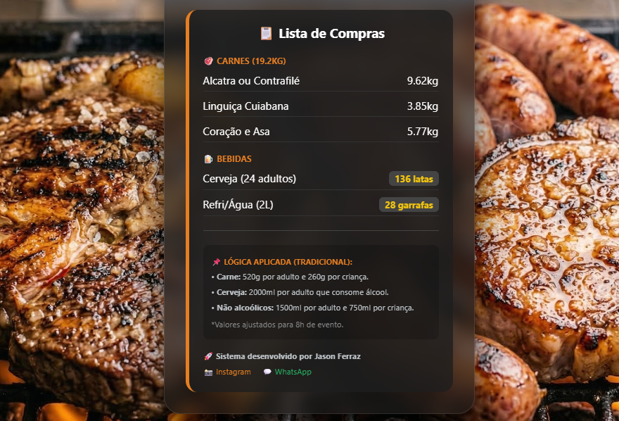

# 🥩 Churrascômetro - JF

Um calculador de insumos para churrasco moderno, com interface responsiva e lógica de consumo inteligente.

## 📱 Demonstração Visual

Aqui está uma pré-visualização de como o sistema funciona:

### 1. O Formulário de Entrada
Nesta tela, o utilizador define o tipo de evento, número de convidados (adultos/crianças), duração e a percentagem de pessoas que consomem álcool. Repare no efeito de vidro (*Glassmorphism*) sobre o fundo fixo da picanha suculenta.

### 2. O Resultado da Lista de Compras
Após clicar em "Gerar Lista", o algoritmo calcula as quantidades exatas de carnes e bebidas. Esta tela também detalha a lógica aplicada e as informações do desenvolvedor.

---

## 🛠️ Tecnologias Utilizadas

O projeto foi construído utilizando tecnologias fundamentais de desenvolvimento web:

* **HTML5**: Estruturação semântica do conteúdo.
* **CSS3**: Estilização avançada com variáveis, Flexbox e efeitos de desfoque (backdrop-filter).
* **JavaScript (Vanilla)**: Lógica de cálculo, manipulação do DOM e integração com a Web Share API.

---

## 👨‍💻 Autor

Desenvolvido por **Jason Ferraz**
- 🎓 Estudante de Engenharia de Software.
- 💼 [LinkedIn](https://www.linkedin.com/in/jason-ferraz-4793712a8)
- 📸 [Instagram](https://instagram.com/jason.ferraz)
- 💬 [WhatsApp](https://wa.me/5541997773745)

---
*Projeto realizado para fins de portfólio e estudo de lógica de programação.*
